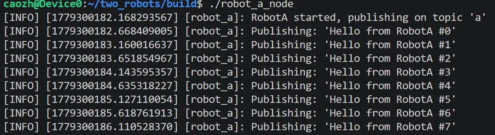
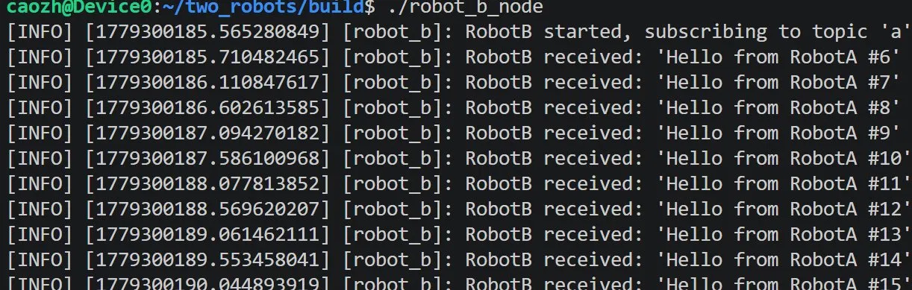

# Run two_robots locally

## compile

```bash
source /opt/ros/humble/setup.bash
cd two_robots
mkdir build && cd build
cmake ..
make
```

## run

```bash
source /opt/ros/humble/setup.bash
./demo
```

## recompile

```bash
cd build
make
```

## If everthing is fun, it should be like




#You can see the subscriber and publisher are running fine